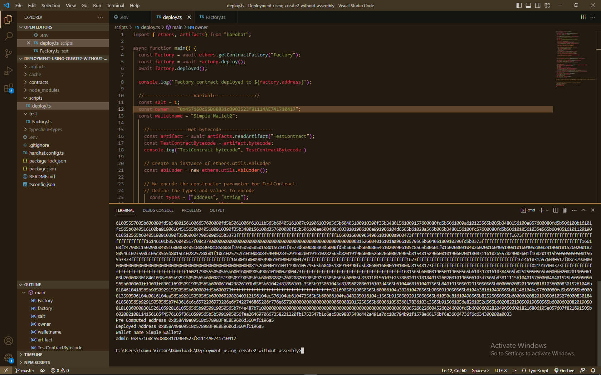
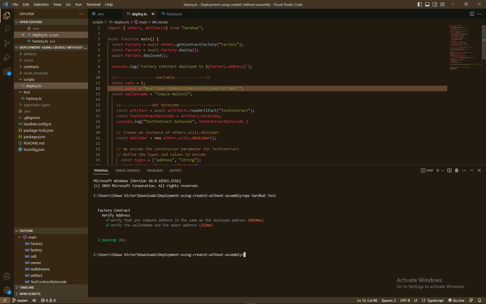

## # Deploying Contract With CREATE2 on Celo without inline Assembly


## Introduction

This article is based on submission done by [Blackadm](https://dacade.org/communities/celo/courses/celo-tut-101/challenges/2f141e8b-104a-4b29-9a23-44f424b52695/submissions/3ace8587-b52a-4553-a408-b93f5752f4ba). It is written to update readers/users on the other method for using create2.  Solidity evolves over time, and there may be changes or updates to the language that introduce new features or keywords which sometimes developers don't get to know about on time.


## Objective

To introduce user to the new method of using create2 opcode without the use of inline assembly, which is shorter and faster to implement.

## Prerequisites

Before you start reading this article you are expected to have read fully and understand the article written by blackadam [Blackadm](https://github.com/Ultra-Tech-code/Deploying-contract-with-create2-on-celo) .

## How to use new create2 opcode
The address of Smart Contracts is normally created by taking the deployersAddress and the nonce. The nonce is ever increasing, but with CREATE2 there's no nonce, instead a salt. The salt can be defined by the user.

To use the new create2 opcode, we need to define two parameters: The **contract**, a unique **salt** value. The **contract** is the contract that is to be deployed, always imported to the factory contract. The **salt** value is a random number that is generated by the developer. 

Majority of everythings that will be needed has been talked about extensively by the article recommended above. I will go straight to the implementation of the new create2.


## tutorial
For this tutorial, we'll need to To create these two contracts files:

- Factory contract file
- TestContract contract file

#### Factory Contract Explained

```solidity

// SPDX-License-Identifier: MIT
pragma solidity ^0.8.10;


import "./TestContract.sol";

contract Factory {

    /**
     * @notice  . A function to Get the address of a contract
     * @dev     . returns an address
     * @param   _owner  . An address[TestContract constructor arguments]
     * @param   _walletname  . A string[TestContract constructor arguments]
     * @param   _salt. A unique uint256 used to precompute an address
    */
    function createContract(
        address _owner,
        string memory _walletname,
        uint _salt
    ) public payable returns (address deployedContract) {
        bytes32 salted = bytes32(_salt);

        deployedContract = address(new TestContract{salt: salted}(_owner, _walletname));
    }


    /**
     * @notice  . A function to Compute address of the contract to be deployed
     * @dev     . returns address where the contract will deployed to if deployed with create2 new opcode
     * @param   _salt: unique uin256 used to precompute an address
    */
    function getAddress(uint _salt, bytes memory bytecode) public view returns (address) {
         bytes32 salt = bytes32(_salt);

        address predictedAddress = address(uint160(uint(keccak256(
            abi.encodePacked(
                bytes1(0xff),
                address(this), 
                salt, 
                keccak256(bytecode) 
            )
        ))));
      
        return predictedAddress;
    }
}


```

The Breakdown of the contract:

- The License identifier was declared
- The Solidity version was declared also
- The contract that we are deploying (Testcontract) is imported.

- `createContract()` Function deploys the contract and returns the address of the deployed contract. it takes in the prameter required by the Testcontract. and a _salt value.
Here, the `new` opcode is used to deploy the contract instead of the inline assembly code used in the old create2. check [this](https://github.com/Ultra-Tech-code/Deploying-contract-with-create2-on-celo/#factory-contract-explained) to understand better.

>**_Note_**: The salt value is a uint256 value. which is converted to bytes32 inside the `createContract` function.

- `getAddress()` Function has been explained by the article recommended. 
>**_Note_**: The salt value passed in here is a uint256 value. which is converted to bytes32 inside the function.

All explanation about the `getContractBytecode()` and `getAddress()` function has been talked about extensively in the prerequisite article. kindly check it out again.


#### TestContract Explained
revert to the prequisite article. [here](https://github.com/Ultra-Tech-code/Deploying-contract-with-create2-on-celo/#testcontract-explained)


### Deploying Your Contracts

### hardhat config update
>**_Note_**: The solidity version in the `hardhat.config.ts` is `0.8.10`. change it from `solidity: "0.8.0",` to `solidity: "0.8.10",`

In your terminal run `npx hardhat compile` to compile the contract.

### Deploy script

```Typescript
import { ethers, artifacts} from "hardhat";

async function main() {
  const Factory = await ethers.getContractFactory("Factory");
  const factory = await Factory.deploy();
  await factory.deployed();

  console.log(`Factory contract deployed to ${factory.address}`);

  //------------------Variable--------------//
  const salt = 1;
  const owner = "0x5B38Da6a701c568545dCfcB03FcB875f56beddC4";
  const walletname = "Simple Wallet2";
  
    //--------------Get bytecode-------------------
    const artifact = await artifacts.readArtifact("TestContract");
    const TestContractBytecode = artifact.bytecode;
    console.log("TestContract bytecode", TestContractBytecode )

    // Create an instance of ethers.utils.AbiCoder
    const abiCoder = new ethers.utils.AbiCoder();
    
    // We encode the constructor parameter for TestContract
    // Define the types and values to encode
      const types = ["address", "string"];
      const values = [owner, walletname];

    // Encode the ata
    const encodeParameter = abiCoder.encode(types, values);

    //we romove the Ox in front of the encoded parameter
    const TestContractParameter = encodeParameter.slice(2);

    const bytecode = TestContractBytecode + TestContractParameter;
    //console.log("new byte code", bytecode)

  //----------------------------------------------------------------------

  const factoryContract = await ethers.getContractAt("Factory", factory.address);

  //get pre computed address of a contract
  const getAddress = await factoryContract.getAddress(salt, bytecode);
  console.log("Pre Computed address", getAddress);

  //-------------------------------------------------------//

  //deploy the contract
  const createContract = await factoryContract.createContract(owner, walletname, salt);
  const txreceipt =  await createContract.wait()
  //@ts-ignore
  const txargs = txreceipt.events[0].args;
  //@ts-ignore
  const TestContractAddress = await txargs.deployedContract
  console.log("Deployed Address", TestContractAddress);

  //--------------Interacting with the deployed simple wallet contract-------------
  const TestContract = await ethers.getContractAt("TestContract", TestContractAddress);

  //Get the wallet Name
  const walletName = await TestContract.walletName();
  console.log("wallet name", walletName);

  //Get the admin address
  const admin = await TestContract.admin();
  console.log("admin", admin);


/**if you try to deploy the contract with the salt again, It revert because "Contract already created with the same salt"*/
//to deploy a replica of the contract, you need to change the salt value

}

// We recommend this pattern to be able to use async/await everywhere
// and properly handle errors.
main().catch((error) => {
  console.error(error);
  process.exitCode = 1;
});

```

### Breakdown of Deployed Script:
- Deployed the Factory contract and log the factory `contract address`
- Declared the necessary parameter requirement

- Get the `bytecode` (when a contract is compiled an artifact is provided whuch comprises of the contract abi, contract bytecode and other things)
The bytecode provided by the compilation of the contract doesn't contain the constructor argument. so `ethers` built in function `AbiCoder` was used to encode the constructor parameter. 
The encoded form of the parameters is in hexadecimal. so the `0x` in front of the encoded parameter is removed and the result is added to the `TestContract` bytecode 
so we have the `TestContract` bytecode  + The encoded parmeter without the `0x`.

>**_Note_**: In the prerequisite article, The bytecode of the Testcontract was gotten using the `getContractBytecode()` function in the `FactoryContract`. With this script written we've been able to reduce the contract size and also avoid spending gas to get the bytecode.

- Get precomputed address by passing salt and bytecode to it.
- Called the `createContract` function passing in the TestContract constructor parameter(owner and walletname) and salt.
- Interacted with the `TestContract` contract passing in the deployed TestContract Address.


Then, let’s deploy our contract using this command line in our VSCode terminal:

```bash
npx hardhat run scripts/deploy.ts --network alfajores
```


You will discover that the deployed address and the precomputed address are the same thing.
So, before deployement, we can always check for the contract address that will be generated when a contract is deployed with create2.

>**_Note_**: In the prerequisite [Article](https://github.com/Ultra-Tech-code/Deploying-contract-with-create2-on-celo/blob/main/Images/deployed.png), The address gotten in the image provided there is different from what we have here because the contract bytecode is different due to changes/contribution proposed by the article evaluator on Dacade and also the parameter passed into the `TestContract` are different.


### Test File
- Test files are typically used to write and organize test cases for specific units of code, such as functions, classes, or modules. This test file contain test cases that verify the behavior and correctness of the code being tested. In the context of Hardhat, unit tests are commonly written using frameworks like Mocha and Chai.

- Rename the `Lock.ts` file inside the Test folder to `Factory.ts`.

### Factory.ts

```Typescript

import { loadFixture } from "@nomicfoundation/hardhat-network-helpers";
import { expect } from "chai";
import { ethers, artifacts } from "hardhat";

describe("Factory Contract", function () {
  // We define a fixture to reuse the same setup in every test.
  // We use loadFixture to run this setup once, snapshot that state,
  // and reset Hardhat Network to that snapshot in every test.

  async function deployFactory() {
    const Factory = await ethers.getContractFactory("Factory");
    const factory = await Factory.deploy();
  
    await factory.deployed();
    const factoryAddress = factory.address;

    //-----------------------------------------------
    const salt = 1;
    const owner = "0x5B38Da6a701c568545dCfcB03FcB875f56beddC4";
    const walletname = "Simple Wallet2";

    const artifact = await artifacts.readArtifact("TestContract");
    const TestContractBytecode = artifact.bytecode;

    // Create an instance of ethers.utils.AbiCoder
    const abiCoder = new ethers.utils.AbiCoder();
    
    // We encode the constructor parameter for TestContract
    // Define the types and values to encode
      const types = ["address", "string"];
      const values = [owner, walletname];

    // Encode the ata
    const encodeParameter = abiCoder.encode(types, values);

    //we romove the Ox in front of the encoded parameter
    const TestContractParameter = encodeParameter.slice(2);

    const bytecode = TestContractBytecode + TestContractParameter;


    return { factoryAddress, salt, owner, walletname, bytecode};
  }

    describe("Verify Address", function () {
      it("verify that pre compute address is the same as the deployed address", async function () {
        const { factoryAddress, salt, owner, walletname, bytecode } = await loadFixture(deployFactory);
        const factoryContract = await ethers.getContractAt("Factory", factoryAddress);


        //get pre computed address of a contract
        const precomputedAddress = await factoryContract.getAddress(salt, bytecode);

        //deploy the contract
        const createContract = await factoryContract.createContract(owner, walletname, salt);
        const txreceipt =  await createContract.wait()
        //@ts-ignore
        const txargs = txreceipt.events[0].args;
        //@ts-ignore
        const TestContractAddress = await txargs.deployedContract

         expect(await TestContractAddress).to.equal(precomputedAddress);
    });

    it("verify the walletName and the owner address", async function () {
      const { factoryAddress, salt, owner, walletname, bytecode } = await loadFixture(deployFactory);
      const factoryContract = await ethers.getContractAt("Factory", factoryAddress);

      //get pre computed address of a contract
      const precomputedAddress = await factoryContract.getAddress(salt, bytecode);

      //deploy the contract
      const createContract = await factoryContract.createContract(owner, walletname, salt);
      const txreceipt =  await createContract.wait()
      //@ts-ignore
      const txargs = txreceipt.events[0].args;
      //@ts-ignore
      const TestContractAddress = await txargs.deployedContract

       //````````````````````````````````````````````````````````
       const TestContract = await ethers.getContractAt("TestContract", TestContractAddress);
       const walletName = await TestContract.walletName();
       const admin = await TestContract.admin();

       expect( walletName).to.equal(walletname);
       expect( admin).to.equal(owner);
  });
  });
});

```

To run the test using the command line in our VSCode terminal:

```bash
npx hardhat test
```

### Factory.ts Explained
Factory.ts is a test file that contains test cases for the factory contract. The test file starts with importing the necessary testing frameworks like chai and sets up a test suite using describe.

Each individual test case is defined using the it function. Inside each test case, an assertions is written using the expect function provided by the testing framework to validate the expected behavior of the code being tested.
e.g. I verify if the TestContractAddress(which is the deployed address) is the same as the precomputed Address. `expect(await TestContractAddress).to.equal(precomputedAddress);`

Before each test case, the beforeEach hook is used to deploy the contract, ensuring a fresh instance is available for each test case.




Here, we can see that the test passed succesfully.

### Conclusion

In addition to what we have in the prerequisite article, the new create2 method is a shorter and efficient method to using create 2 to deployed a contract.


The link to my project repository can be found [here](https://github.com/Ultra-Tech-code/Deployment-with-create2).


### External Link
For deeper and dangerous use case of create2 check out this [repo](https://github.com/0age/metamorphic)